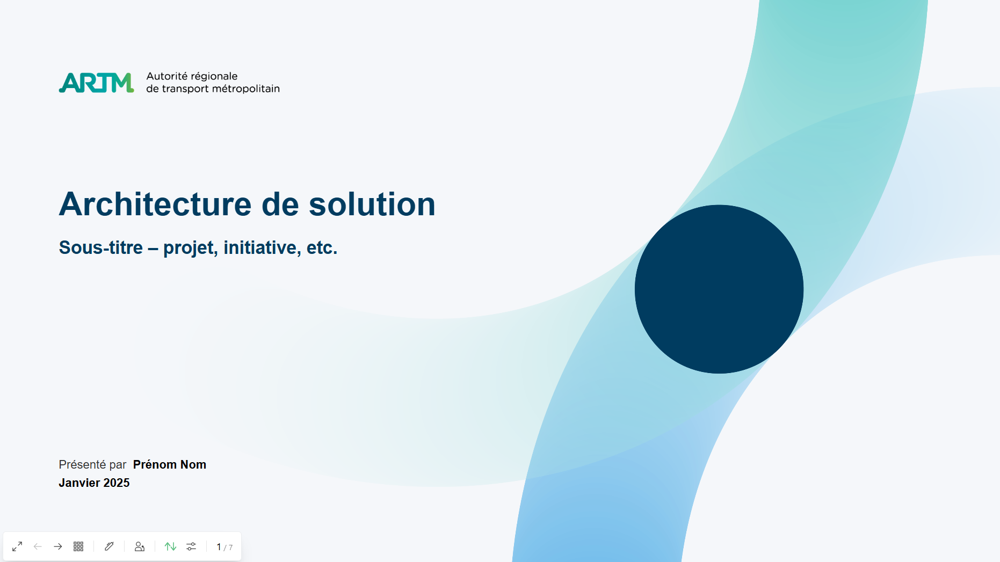

# Slidev - Thème ARTM

Thème Slidev de l'**ARTM** – Autorité Régionale de Transport Métropolitain.

Converti depuis le gabarit PowerPoint `GabaritComitéArch_Architecture de solutions TI - ARTM.potx`.

Afin de faciliter l'adoption de cet outil, un thème Slidev aux couleurs de l'ARTM a été développé. Celui-ci permet de produire rapidement des présentations respectant l'identité visuelle de l'organisation tout en bénéficiant des avantages d'une approche moderne, collaborative et orientée automatisation.
Cette solution est particulièrement intéressante pour les architectes, analystes, spécialistes M365, équipes TI et toute personne produisant régulièrement de la documentation technique, des formations ou des présentations de projets.

## Slidev

Slidev est un outil de création de présentations basé sur Markdown, conçu à l'origine pour les développeurs et les spécialistes des technologies. Contrairement à PowerPoint, les diapositives sont décrites sous forme de texte dans un fichier source, puis générées automatiquement en une présentation moderne, interactive et entièrement personnalisable. Slidev permet également d'intégrer facilement du code source, des démonstrations interactives, des diagrammes et des composants Web.

https://sli.dev/

## Prérequis

- [Docker](https://www.docker.com/) + Docker Compose (aucun Node.js requis en local)

## Aperçu local (Docker)

```bash
docker compose up --build
# → http://localhost:3030
```

Pour arrêter :

```bash
docker compose down
```

Pour repartir de zéro (vider le cache npm) :

```bash
docker compose down -v
docker compose up --build
```

## Installation dans une présentation



```yaml
---
theme: slidev-theme-artm          # publié sur npm
# ou chemin local :
theme: ../slidev-theme-artm
---
```

## Réutilisation pour un autre projet

Les fichiers réutilisables sont dans ce repo:

- `templates/SKILL.md`
- `templates/project-context.md`

Pour un repo qui réutilise ce thème:

1. Copier `templates/SKILL.md` vers `.github/skills/SKILL.md` dans le repo cible.
2. Copier `templates/project-context.md` dans `templates/` du repo cible.
3. Utiliser `templates/project-context.md` pour collecter le contexte.
4. Utiliser un des prompts ci-dessous dans Copilot Chat.
5. Générer puis adapter `slides.md` directement a partir du contexte projet.

Structure recommandee dans le repo cible:

```text
<repo-cible>/
	.github/
		skills/
			SKILL.md
	templates/
		project-context.md
```

### Exemple de prompt (générique)

```md
Génère une présentation Slidev complète en français.

Lis :

- slides.md
- project-context.md
- toute la documentation du dépôt

Respecte toutes les règles définies dans SKILL.md.

Utilise slides.md comme blueprint officiel.

Génère toutes les diapositives applicables.

Complète les sections autant que possible.

Ajoute des diagrammes Mermaid lorsque pertinent.

Produis :

1. slides.md complet
2. Plan des diapositives
3. Hypothèses
4. Éléments manquants
```

### Exemple de prompt (ARTM architecture)

```md
Génère une présentation d'architecture complète en français utilisant le thème Slidev ARTM.

Avant de commencer :

1. Lire slides.md et l'utiliser comme blueprint officiel.
2. Lire project-context.md.
3. Analyser tout le contenu du dépôt.

Analyser notamment :

- Architecture
- Exigences
- Gouvernance
- Sécurité
- Exploitation
- FinOPS

Exigences :

- Générer toutes les diapositives du blueprint applicables.
- Compléter toutes les sections.
- Générer des diagrammes Mermaid lorsque pertinent.
- Produire les vues contextuelle, fonctionnelle, applicative, données et opérationnelle.
- Produire les risques, la feuille de route et les recommandations.
- Ne pas produire un squelette de présentation.
- Ne pas inventer de faits.

La présentation finale doit être prête à être présentée et compréhensible sans devoir consulter la documentation source.

Produire :

1. slides.md complet
2. Plan des diapositives
3. Hypothèses
4. Éléments manquants
5. Diagrammes suggérés mais impossibles à générer faute d'information
```

## Mises en page disponibles

| Layout | Frontmatter | Description |
|--------|-------------|-------------|
| `cover` | `presenter`, `date` | Diapositive de titre avec fond teal et logo |
| `default` | `docTitle` | Contenu standard, titre avec séparateur teal |
| `section` | `sectionNo` | Page de section – cercle blanc + icône + numéro |
| `subsection` | `sectionNo` | Page de sous-section |
| `two-cols` | `docTitle` | Deux colonnes avec slot `::header::` optionnel |
| `statement` | — | Fond marine complet – mission, vision |
| `end` | `website`, `address` | Conclusion avec « Merci ! » |

### `cover`

```yaml
---
layout: cover
presenterName: "Prénom Nom"
date: "Janvier 2025"
---

# Titre de la présentation

Sous-titre ou description
```

### `section`

```yaml
---
layout: section
sectionNo: "01"
---

# Titre de la section

Sous-titre optionnel
```

### `two-cols` — titre au-dessus des deux colonnes

```md
---
layout: two-cols
---

Contenu colonne gauche

::header::
# Titre au-dessus des deux colonnes

::right::

Contenu colonne droite
```

> **Note :** Le contenu avant tout `::marker::` va dans la colonne gauche (slot par défaut).

### `end`

```yaml
---
layout: end
website: artm.quebec
address: "700, rue De La Gauchetière Ouest, bureau 400, Montréal (Québec) H3B 5M2"
---

# Merci !
```