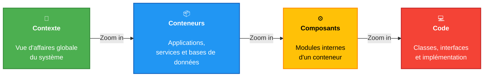
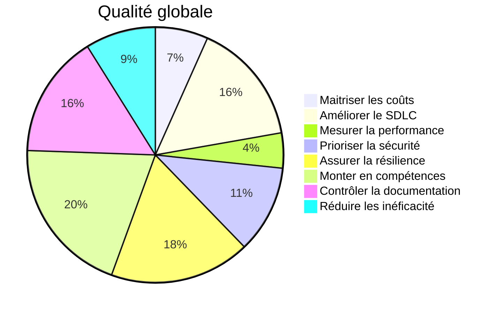

# Architecture de solution

Sous-titre – projet, initiative, etc.

---
layout: agenda
---

# Contenu de la présentation

---
layout: section
sectionNo: 01
---

# Mise en contexte

---
layout: default
---

# Mise en contexte

## Historique

- Décrire le contexte du projet/initiative/ajustement au produit qui nécessite de présenter une nouvelle architecture.
- Il faut également identifier l'objectif de la présentation (par opposition à l'objectif de l'architecture ou de l'initiative).  C'est-à-dire (Approbation, avis, orientations, autres) 
- On peut ajouter quelques éléments d'intérêts:
  - Les jalons importants à atteindre (peuvent également se retrouver dans les contraintes)
  - L'envergure de l'investissement global
  - Le promoteur ou les parties prenantes notables

---
layout: two-cols
---

### Motivations

- Motivation 1 - Décrire l'ensemble des motivations sous forme de petits descriptifs.  Qu'est-ce qui motive la réalisation de cette initiative.   Ce sont des motivations d'affaires, désuétudes, bogues, performance, préparation au futur, etc.
- Motivation 2 - Il peut y avoir plusieurs motivations….

::header::
# Mise en contexte
## Motivations et objectifs

::right::

### Objectifs

- Objectif 1 - Lister l'ensemble des objectifs qui seront atteints avec la solution proposée dans ce document
- Objectif 2 - L'ensemble des objectifs….
- Faire ressortir les éléments stratégiques dignes de mention.

---
layout: section
sectionNo: 02
---

# Contraintes

---
layout: two-cols
---

### Contraintes

- Contrainte 1 - Lister l’ensemble des contraintes qui ont dû avoir été prises en compte pour élaborer cette solution.  Il ne s'agit pas de risques projets, mais bien des contraintes qui doivent absolument tenu en compte
- Contrainte 2 - Les contraintes sont diverses: 
  - Des contraintes de temps (livraison avant telle date – fin de contrat, changement de loi)
  - Des contraintes de compatibilité à l’existant
  - Des contraintes d’affaires (manque de fonds, politique, alignement stratégique, etc.)
  - Une contrainte temporaire (architecture partielle pour un plan de transition)
  - Des contraintes légales

::header::
# Contraintes
## Contraintes d’affaires et technologiques actuelle (hypothèses)

::right::

- Contrainte n
- …
- Contrainte n+1
- …

---
layout: section
sectionNo: 03
---

# Exigences

---
layout: two-cols
---

### Exigences

- Exigence 1
  - Lister l’ensemble des exigences technologiques (technologies, performance requises, stockage, bande passante, puissance de calculs, etc.), langages, nombre d’environnements, accès aux systèmes externes, plateformes d’intégration, plateforme de déploiement (containers…), console de gestion, etc.
- Exigence 2
  - N’oubliez pas les exigences opérationnelles pour le soutien, la surveillance et le service à la clientèle

::header::
# Exigences obligatoires
## Exigences technologiques et fonctionnels

::right::

- Exigence n
- …
- Exigence n+1
- ...
---
layout: two-cols
---

- Requis 1
  - Lister les requis qualité globale pertinents incluant la sécurité pour aider le lecteur à comprendre la solution et les raisons des choix qui ont été faits tout en couvrant les différentes facettes d’architecture.
- Requis 2
  - Soyez ambitieux et documentez vos SLOs en fonction de la structure des services/parcours utilisateurs que l’architecture introduit ou modifie.
- Requis 3
  - Il faut faire des choix éditoriaux, il ne s’agit pas de reproduire l’analyse d’affaires exhaustives qui a pu être faite. 
  - Référer les documents des analystes d'affaires, s'il y a lieu

::header::
# Exigences obligatoires
## Exigences de qualité globale et de sécurité

::right::

- Requis n
- …
- Requis n+1
- …

---
layout: section
sectionNo: 04
---

# Architecture cible

---
layout: subsection
subSectionNo: 4.1
---

# Architecture cible

## Résultat de la vigie

---
layout: two-cols
---

- Décrire la vigie et en faire un résumé.
- Il faut faire un résumé de la vigie correspondante (ou de l'ensemble des vigies pertinentes).   Ici on fait des choix par rapport à la vigie qui sont pertinents aux choix qui ont été faits pour la solution présentée.
- Mettre les liens vers les vigies pour pleine transparence.

::header::
# Architecture cible
## Résultat de la vigie

::right::

---
layout: subsection
subSectionNo: 4.2
---

# Architecture cible

## Requis fonctionnel

---
layout: two-cols
---

### Requis d'affaires et/ou techniques

- Requis 1
  - Lister les requis d'affaires ou techniques pertinents pour aider le lecteur à comprendre la solution et les raisons des choix qui ont été faits tout en couvrant les différentes facettes d'architecture (affaires, applications, données et infrastructures).
  - La différence avec les exigences technologiques de la section précédente est que ceux-ci ne sont pas obligatoires (comme les contraintes ou les exigences) et pourraient être réévalués si c'était absolument nécessaire.
- Requis 2
  - Il faut faire des choix éditoriaux, il ne s'agit pas de reproduire l'analyse d'affaires exhaustives qui a pu être faite. 
  - Référer les documents des analystes d'affaires, s'il y a lieu

::header::
# Architecture cible
## Requis fonctionnel

::right::

- Requis n
- …
- Requis n+1
- …

---
layout: subsection
subSectionNo: 4.3
---

# Architecture cible

## Diagramme (logique, contexte, systèmes, données, etc.)

---
layout: default
---

# Architecture cible

## Description de la solution et de son contexte

---
layout: default
---

# Architecture cible

## Architecture cible Vue contextuelle

---
layout: default
---

# Architecture cible

## Architecture cible (Vue applicative ou fonctionnelle)

---
layout: default
---

# Architecture cible

## Architecture cible (Vue donnée, indicateurs et tableaux de bord)

---
layout: default
---

# Architecture cible

## Architecture cible (Vue opérationnelle) Surveillance, gestion des incidents, collaboration inter-équipes

---
layout: two-cols
---

::header::
# Composition de la Qualité Globale et axes prioritaires

::right::

> QLO - Gestion du risque
>
> Qualification & Quantification

||Qualification|Quantification|
|---|---|---|
|#1 SDLC|||
|#2 Performance|||
|#3 Sécurité|||
|#4 Résilience|||
|#5 Compétence|||
|#6 Doc|||
|#7 Inefficacité|||
|#8 FinOps|||

---
layout: section
sectionNo: 05
---

# Stratégie de réalisation

---
layout: two-cols
---

### Stratégie de sourçage
- Sourçage1
  - Lister le ou les types de sourçage nécessaires à la réalisation de la solution: Développement maison, consultants externes (entente-cadre ou AO), équipes de train, impartition à un tier (OPTC, OBNL ou AO), AO pour un produit, MCN, incluant son opérationnalisation et son suivi de qualité, etc.

::header::
# Stratégie de réalisation
## Stratégie de sourçage, estimés des efforts, plan de déploiement ou migration

::right::

- Sourçage 2
  - Pour toutes les étapes qui nécessitent un appel au marché, lister les étapes nécessaires de sollicitation:
  - Appels d'intérêts, prix
  - Homologation
  - Négociation avec le MCN, comparaison détaillée des produits au catalogue et processus de sélection

---
layout: default
---

# Stratégie de réalisation
## Volet FinOPS (Ajouter autant de lignes que nécessaires)

|Ressources|Coûts mensuel (par env. n-prod)|Coûts mensuel (non-prod)|
|---|---:|---:|
|1 EventHubs (namespace partagé)|||
|1 base Cosmos DB (stockage des données) _(5 GB, autoscaling max 1k RU à 30%-80%, 1 région)_|||
|Front-door avec WAF (partagé)|||
|Azure Monitor|||
|Utilisation du cluster AKS|||
|Coûts plateforme|||
|
**Total**
|**$0.00**|**$0.00**|

---
layout: two-cols
---

- Estimé
  - Proposer un estimé en effort, et proposer un échéancier réaliste mais dans un scénario positif – l’architecture n’est pas de la gestion de projets, on ne doit tenir compte que des contraintes présentées dans ce document

::header::
# Stratégie de réalisation
## Stratégie de sourçage, estimés des efforts, plan de déploiement ou migration 

::right::

- Plan de déploiement
  - Les étapes qui suivent après le sourçage
  - Installation d’équipements, déploiement des solutions, décommissionnement des solutions en place le cas échéant
  - Le plan de transition et les phases (les jalons importants) dans le cas d’un déploiement MVP/agile

---
layout: section
sectionNo:
---

# Annexe

---
layout: default
---

# Aiguilleur CAM

|Domaines d'impacts|Impacts (1-5)|Commentaires|
|---|---|---|
|Sécurité|||
|Opérations des OPTC|||
|Systèmes existants|||
|Ressources humaines|||
||||

---
layout: statement
---

# Mission de l'ARTM

Assurer la coordination du transport collectif sur le territoire de la Communauté métropolitaine de Montréal.

---
layout: end
website: artm.quebec
address: "1001, boulevard Robert-Bourassa bureau 400 Montréal (Québec) H3B 4L4"
---

# Merci !
